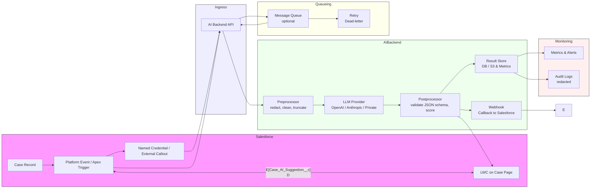

# Architecture Diagram — Case Automation: AI-based Summarization & Auto-Response

Below is a system architecture diagram in Mermaid for quick viewing in Markdown renderers that support Mermaid. It describes the components and the data flow for the AI-based Case Summarization and Auto-Response solution.

Explanation:
- Salesforce triggers an outbound call when a Case is created or updated (Apex trigger, Flow, or Platform Event).
- The outbound call uses a Named Credential to authenticate to the AI Backend API.
- The AI Backend preprocesses text (PII redaction, truncation), calls an LLM provider with a robust prompt, and postprocesses/validates the returned JSON.
- Results are stored in a result store and sent back to Salesforce via a callback endpoint or Platform Event, and surfaced in the LWC on the Case page.
- Optional queueing and retry mechanisms handle scale and transient errors.
- Monitoring and audit logs track usage and help with compliance.

This mermaid diagram is viewable in compatible Markdown viewers (GitHub may need file extension and repo settings to render Mermaid). For other renderers, see the PlantUML file.
